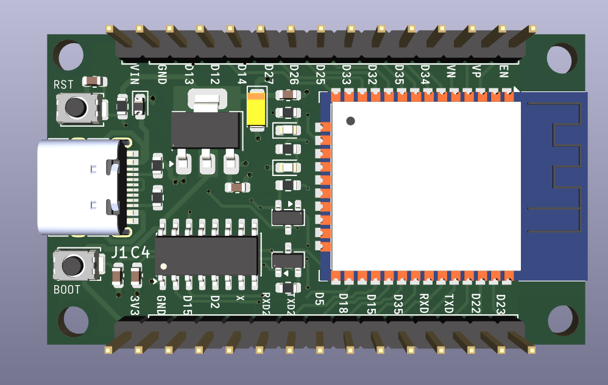
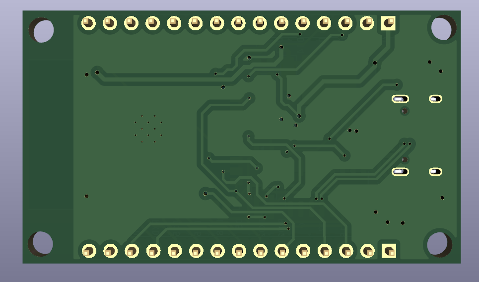
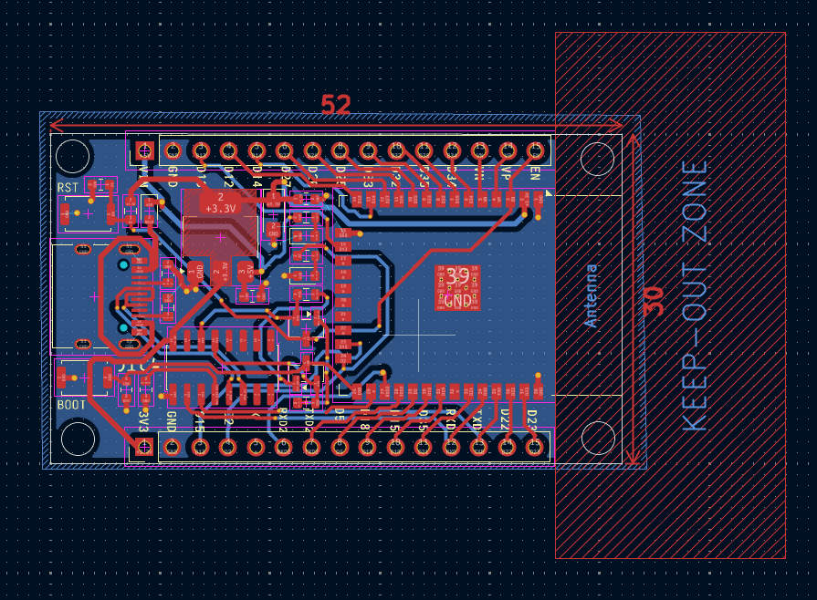
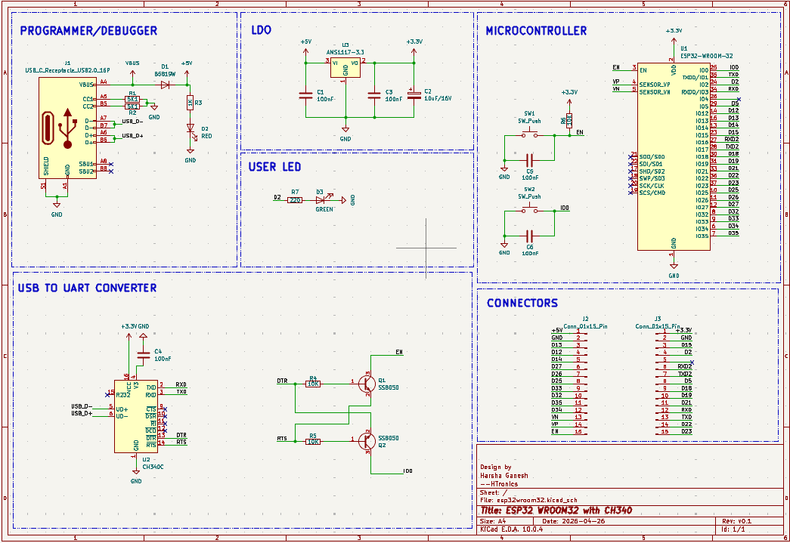

# ESP32-WROOM-32 Custom Development Board
**Designed by HTronics (Harsha Ganesh)**

A custom, breadboard-friendly development board for the ESP32-WROOM-32 module. This board features a modern USB-C interface, reliable serial communication via the CH340C, and an automatic bootloader entry circuit for seamless flashing.

---

## 📸 Project Showcase

### 3D Renders

  
  

### PCB Layout & Schematic

  
  

---

## ✨ Key Features

* **Modern Connectivity:** USB 2.0 Type-C receptacle with 5.1kΩ pull-down resistors on the CC lines, ensuring compatibility with standard Type-A to Type-C and Type-C to Type-C cables.
* **Auto-Programming Circuit:** Built-in two-transistor (SS8050) auto-reset circuit driven by DTR/RTS lines. No need to hold the "BOOT" button to flash firmware.
* **Robust Power Delivery:** Uses the AMS1117-3.3 LDO to step down 5V VBUS to a stable 3.3V for the ESP32, paired with 100nF and 10uF decoupling capacitors. Includes a B5819W Schottky diode for back-power protection.
* **USB-to-UART:** CH340C bridge provides reliable serial communication without requiring an external crystal oscillator.
* **User I/O:** Includes standard EN (Reset) and IO0 (Boot) tactile switches, a dedicated Red power LED, and a Green user LED mapped to GPIO 2.
* **Breadboard Friendly:** 2x15 pin headers break out all essential ESP32 GPIOs, strapping pins, and power rails.

---

## 🛠️ Hardware Overview & Schematic Sections

### 1. Power Supply (`AMS1117-3.3`)
The board takes 5V input from the USB-C VBUS line. A B5819W reverse-polarity protection diode prevents current from feeding back into the host device. The AMS1117-3.3 low-dropout regulator supplies up to 1A of 3.3V power, more than sufficient for the ESP32's RF transmission peaks. 

### 2. USB-to-UART Bridge (`CH340C`)
The CH340C handles USB data enumeration. 
* **Driver Note:** If you are using Linux (e.g., Fedora, Ubuntu), the CH340 driver is already built directly into the kernel—making it truly plug-and-play without any manual DNF/APT installations. Windows and macOS users may need to install the official WCH drivers.

### 3. Auto-Reset Circuit (`SS8050 Transistors`)
The CH340C toggles the `DTR` and `RTS` pins during the firmware upload sequence. The two SS8050 NPN transistors translate these signals into the precise timing sequence required to pull `EN` (Reset) low while `IO0` is held low, putting the ESP32 into flash mode automatically.

---
